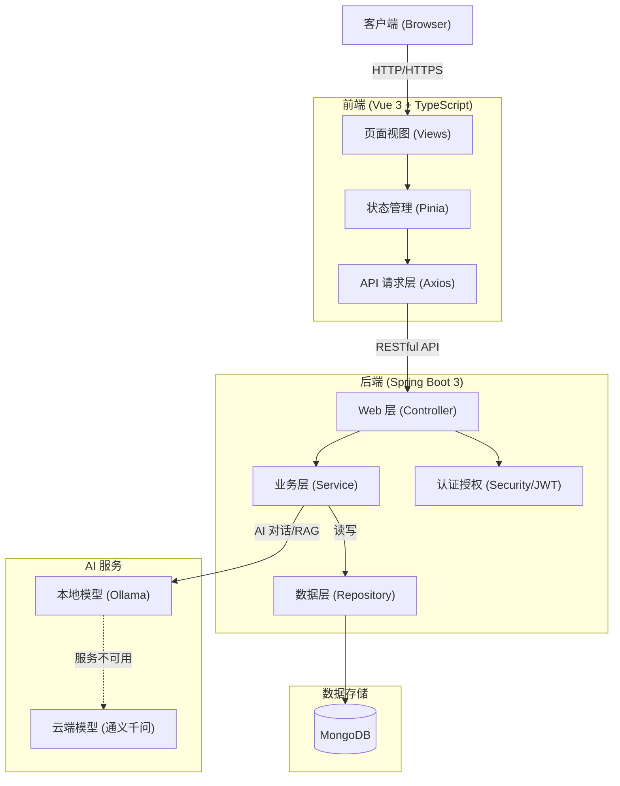

# 项目部署与运行（README）

本 README 聚焦“如何在本地或服务器上快速运行本项目”。功能使用说明请查看《用户手册》，历史沉淀请查看《工作日志》。

## 项目简介

一个帮助把「这一天」接起来的自律应用。打卡、番茄、单词和任务不再各自为政：首页用「今日节律」告诉你下一件该做什么，并用同一套热力说明这一天为什么长成这样。

我们不和 Forest / Anki / Todoist 比单点功能，比的是一天怎么排：专注是为了推掉具体任务，复习嵌在专注之后的两分钟，完成与否会改变当天热力。

前端基于 Vue 3 + TypeScript，后端基于 Spring Boot + MongoDB。AI 对话优先使用本地 Ollama，失败时回退到通义千问。

## 核心功能

- 今日节律（主路径）：
  - 打开应用先看下一动作：未打卡 → 到期词 3 张 → 绑任务的番茄 → 写今日日记 → 自由专注
  - 热力构成公开可解释：打卡×1 + 番茄×2 + 单词×1 + 任务×3
  - 长期 KPI / 图表默认收起，首页加载失败会明确提示
- 日历 & 打卡：
  - 一键打卡；统计“连续/累计天数”
  - 年度热力图（按活动量量化：打卡/番茄/单词/任务）
  - 日详情含日记徽章，日记不计入热力
- 番茄钟：
  - 25/5 分钟专注节奏，前后台运行稳定
  - 开始前可绑定进行中任务，结束后回写任务耗时；工作番茄结束后抽 3 张到期词
- 单词学习：
  - 后端艾宾浩斯间隔安排复习（dueDate）；新增/删除/复习与趋势图
- 任务与仪表盘：
  - 任务清单支持开始/截止日期与实际耗时；完成与否改变当天热力
  - 仪表盘以节律卡为入口，而不是并列三个 CTA
- 我的日记：
  - 日终收口：记录每日心情与感悟，支持标签、智能配图、PDF/Word 导出
- AI 对话：
  - 多会话；`/ai/chat` 与 `/ai/chat/stream`；请求会带上今日节律只读上下文
  - 后端优先走 Ollama，本地不可用时回退通义千问
- 书籍推送（扩展）：
  - 瀑布流布局展示，支持分页、搜索、排序、收藏、样例导入与详情查看
- 液态主题：
  - 池核 / 海洋核 / 水晶核 / 雨核 × 明暗，选择会记住；也可随日记心情切换

## 技术栈与架构

### 技术选型

- **前端**：Vue 3.5、TypeScript 5.8、Vite 6、Pinia、Vue Router、Axios、Element Plus
- **后端**：Spring Boot 3.5、Java 21、Spring Security、WebClient、JWT、Spring Data MongoDB
- **AI**：Ollama (本地大模型，优先)、阿里云通义千问 (云端回退)
- **数据库**：MongoDB 4.4+

### 系统架构图



## 一、系统要求

- Node.js 20+（LTS）
- Java 21（推荐 Temurin 21）
- Maven 3.6+
- MongoDB 4.4+（本地或云端 Atlas 皆可）

## 二、快速启动（推荐）

提供跨平台启动脚本：

### Windows

```powershell
# 启动后端
.\start-backend.bat

# 启动前端
.\start-frontend.bat
```

### Linux / macOS

```bash
# 启动后端
./start-backend.sh

# 启动前端
./start-frontend.sh
```

> 如遇 Java/MongoDB 环境缺失，请参考“环境准备”。

## 三、手动启动（可选）

### 1）准备 MongoDB

```bash
# Windows（服务方式或直接 mongod）
mongod

# Linux/Mac
sudo systemctl start mongod
```

### 2）启动后端

```bash
cd backend
mvn clean compile -DskipTests
mvn spring-boot:run
# 访问 http://localhost:8080
```

### 3）启动前端

```bash
cd frontend
npm install
npm run dev
# 访问 http://localhost:3000
```

## 四、环境准备与配置

### 1）Java 21 安装（必要）

- Windows 推荐：Eclipse Temurin 21 或 Microsoft OpenJDK 21（安装并勾选 JAVA_HOME 与 PATH）
- 验证：`java -version` 应显示 21

### 2）MongoDB 安装

- 本地安装或使用 MongoDB Atlas 云服务
- 验证端口：`27017` 可连通

### 3）后端配置（backend/src/main/resources/application.yml）

```yaml
spring:
  data:
    mongodb:
      uri: ${MONGODB_URI:mongodb://localhost:27017/self_discipline}

jwt:
  secret: ${JWT_SECRET:}
```

必须设置环境变量 `JWT_SECRET`（至少 32 字节的随机串）。未配置或仍使用旧占位密钥时，后端会拒绝启动。

（如使用 Atlas，请将 uri 替换为云端连接字符串）

### 4）前端开发代理（vite.config.ts，已配置）

- 默认将以 `/api` 代理到 `http://localhost:8080`
- Axios 已启用 `withCredentials: true`

## 五、常见问题（快速排查）

- 后端启动报 Java 版本不兼容
  - 切换到 Java 21；重新 `mvn clean compile && mvn spring-boot:run`
- 前端出现 CORS（跨域）提示
  - 确认后端已重启，前端代理与 Axios 配置生效
- 访问无数据或接口 404
  - 确认后端已启动、MongoDB 正常、接口路径以 `/api` 开头

更多详尽排障与 CORS 最佳实践见《工作日志》相关章节。

## 六、项目结构（简要）

```
.
├── backend/     # Spring Boot 后端
│   └── src/main/java/com/selfdiscipline/...
├── frontend/    # Vue 3 前端
│   └── src/...
├── 工作日志.md
├── 用户手册.md
└── README.md
```

## 七、参考与延伸

- 功能使用与说明：见《用户手册.md》
- 历史记录与技术沉淀：见《工作日志.md》
- 主路径走查截图清单：见 `docs/demo/README.md`

## 附：Ollama 本地启动与配置（可选，用于本地大模型）

后端已优先尝试通过本地 Ollama 提供 AI 回复（失败时回退到通义千问）。默认地址与模型：`http://127.0.0.1:11434`、`llama3.1`。

### 1）安装 Ollama

- Windows（推荐）
  - 使用 winget：
    ```powershell
    winget install Ollama.Ollama
    ```
  - 或到官网下载安装包：`https://ollama.com`

- macOS（Homebrew）

  ```bash
  brew install ollama
  ```

- Linux
  ```bash
  curl -fsSL https://ollama.com/install.sh | sh
  ```

### 2）启动服务

- 大多数情况下安装完成会自动作为服务运行；若需要手动：
  ```bash
  ollama serve
  ```

### 3）拉取并准备模型

```bash
ollama pull llama3.1
# 或者选择其他模型（例如通义）
# ollama pull qwen2.5:7b
```

### 4）本地连通性测试

```bash
curl http://127.0.0.1:11434/api/generate \
  -H "Content-Type: application/json" \
  -d '{"model":"llama3.1","prompt":"你好！"}'
```

### 5）后端配置（如需自定义）

在 `backend/src/main/resources/application.yml` 里添加/覆盖：

```yaml
ollama:
  base-url: http://127.0.0.1:11434
  model: llama3.1
```

说明：

- `ollama.base-url` 指向你本地或远程的 Ollama 服务地址
- `ollama.model` 为你已 `pull` 的模型名称

完成后重启后端：

```bash
cd backend
mvn spring-boot:run
```

最后更新：2026-09-21
